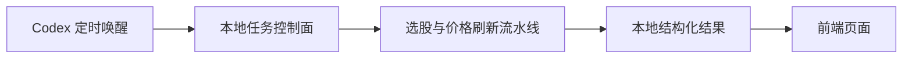

# 牧牛记

牧牛记是一个规则型 A 股选股与复盘系统。当前主链路已经本地化：



系统只做规则化筛选、复盘和数据看板，不构成投资建议。

## 目录

- `backend/api.py`：本地任务控制 API。
- `backend/job_store.py`：本地任务状态持久化，默认写入 `outputs/jobs/job_runs.json`。
- `backend/jobs/daily_selection.py`：全量选股任务 wrapper。
- `backend/jobs/price_refresh.py`：历史入选股票价格刷新和复盘任务 wrapper。
- `skills/stock-selection-agent/scripts/`：选股、行情抓取、评分、复盘和 dashboard JSON 生成脚本。
- `config/local_selection_job.json`：Codex 自动化使用的日度选股配置。
- `config/trading_calendar.json`：A 股交易日配置。
- `frontend/`：读取本地 JSON 的 Vite + React 看板。
- `data/dashboard/`：前端唯一数据源，包含日期索引和单日详情 JSON。
- `outputs/daily/`：每日归档结果，包含候选池、评分 CSV、Markdown 报告和 manifest。

## 数据链路

1. Codex 自动化在交易日北京时间 08:30 触发 `daily-full-selection`。
2. 本地日度任务计算上一个完整交易日，抓取 Tencent 行情，生成候选池。
3. 评分脚本输出 `outputs/daily/<YYYYMMDD>/selection_scores.csv` 和 `selection_report.md`。
4. 日度任务写入 validation workbook，重建 `data/dashboard/runs_index.json` 和 `data/dashboard/runs/<YYYYMMDD>.json`。
5. 日度任务成功后发布 `data/snapshots/latest` 和 `outputs/daily/latest`。
6. Codex 自动化在交易日北京时间 16:10 触发 `daily-price-refresh`。
7. 价格刷新任务更新历史入选股票的后续价格、复盘表现，并再次重建 `data/dashboard/`。
8. 前端页面只读取 `data/dashboard/` 下的本地 JSON。

## 本地环境

复制本地配置模板：

```powershell
Copy-Item .\config\local.env.example .\config\local.env
notepad .\config\local.env
```

需要保留：

```text
ADMIN_TRIGGER_TOKEN=
APP_TIMEZONE=Asia/Shanghai
JOB_STORE_PATH=outputs/jobs/job_runs.json
```

`config/local.env` 已被 git 忽略，不要提交。

安装依赖：

```powershell
python -m pip install -r .\requirements.txt
npm.cmd --prefix frontend install
```

本地 dry-run：

```powershell
python -m backend.jobs.daily_selection --dry-run --trigger-source local
python -m backend.jobs.price_refresh --dry-run --trigger-source local
```

启动本地 API：

```powershell
uvicorn backend.api:app --host 127.0.0.1 --port 8000
```

手动触发：

```powershell
curl -X POST "http://127.0.0.1:8000/jobs/daily-selection" `
  -H "Authorization: Bearer $env:ADMIN_TRIGGER_TOKEN" `
  -H "Content-Type: application/json" `
  -d "{\"dry_run\": true}"

curl -X POST "http://127.0.0.1:8000/jobs/price-refresh" `
  -H "Authorization: Bearer $env:ADMIN_TRIGGER_TOKEN" `
  -H "Content-Type: application/json" `
  -d "{\"dry_run\": true}"
```

前端开发：

```powershell
npm.cmd --prefix frontend run dev
```

Vite 会把仓库根目录的 `data/dashboard/` 挂到 `/data/dashboard/`，页面无需远端配置。

## 交易日配置

`config/trading_calendar.json` 默认按周一到周五作为交易日。官方休市日写入 `holidays`，临时开市日写入 `makeup_trading_days`。Codex 自动化在非交易日被唤醒时，会记录成功跳过，`result_payload.skipped=true`、`reason=non_trading_day`。

## 测试

```powershell
python -m unittest discover -s tests -v
npm.cmd --prefix frontend run build
python .\skills\stock-selection-agent\scripts\build_dashboard_data.py
```

前端源码和构建产物不需要任何远端数据库或部署平台配置。
