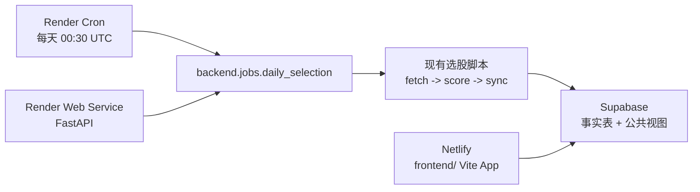

# 牧牛记

牧牛记是一个规则型 A 股选股系统。当前项目已经从单机脚本重构为三层部署架构：Netlify 承载公开只读看板，Render 承载后端 API 与每日选股任务，Supabase 作为生产数据库和看板唯一数据源。

核心选股算法仍保留在 `skills/stock-selection-agent/scripts/` 下，云端改造主要增加部署壳、任务状态、Supabase 写入和前端读取链路。

## 架构



- 前端：`frontend/`，Vite + React，部署到 Netlify。
- 后端：`backend/`，FastAPI + Uvicorn，部署到 Render Web Service。
- 定时任务：Render Cron Job，每天 UTC `00:30`，对应北京时间 `08:30`。
- 数据库：Supabase，事实表由 `service_role` 写入，公共 dashboard 视图由 anon 只读访问。
- 本地辅助：Excel 和 `data/dashboard/` 仍可用于开发、导出和回放，不再作为生产主数据源。

## 目录

- `frontend/`：牧牛记看板，读取 Supabase 公共视图 `dashboard_runs_index` 和 `dashboard_runs`。
- `backend/api.py`：Render Web Service 入口，提供健康检查、手动触发和任务状态查询。
- `backend/jobs/daily_selection.py`：Render Cron 包装器，计算上一完整交易日并调用现有日任务。
- `backend/jobs/supabase_price_update.py`：Supabase 价格和表现 upsert 辅助逻辑。
- `skills/stock-selection-agent/scripts/`：原有选股、评分、验证、Supabase 同步脚本。
- `config/daily_selection.json`：本地完整日任务配置，会更新本地 Excel、dashboard JSON 和 Supabase。
- `config/render_daily_selection.json`：Render 生产任务配置，只执行抓取、评分和 Supabase 写入。
- `supabase/migrations/`：Supabase 表、RLS、公共视图和任务状态表迁移。
- `render.yaml`：Render Web Service + Cron Job Blueprint。
- `netlify.toml`：Netlify 构建配置。
- `docs/cloud_deployment.md`：云端部署细节。

## 数据链路

1. Render Cron 在北京时间 08:30 触发。
2. `backend.jobs.daily_selection` 计算上一完整交易日作为 `run_date` 和 `as_of_date`。
3. 现有脚本抓取 Tencent 行情和前复权 K 线，生成候选池。
4. 评分脚本输出 `selection_scores.csv` 和 Markdown 报告。
5. `sync_supabase.py` 将 run、results、prices、performance 结构化写入 Supabase。
6. Supabase 公共视图聚合出 dashboard 所需日期、核心指标和明细 payload。
7. Netlify 前端只用 anon key 读取公共视图并展示。

## 环境变量

本地开发可复制模板：

```powershell
Copy-Item .\config\local.env.example .\config\local.env
notepad .\config\local.env
```

需要填写：

```text
SUPABASE_URL=
SUPABASE_SERVICE_ROLE_KEY=
ADMIN_TRIGGER_TOKEN=
APP_TIMEZONE=Asia/Shanghai
```

`config/local.env` 已被 git 忽略，不能提交。

Render 环境变量：

- `SUPABASE_URL`
- `SUPABASE_SERVICE_ROLE_KEY`
- `ADMIN_TRIGGER_TOKEN`
- `APP_TIMEZONE=Asia/Shanghai`

Netlify 环境变量：

- `VITE_SUPABASE_URL`
- `VITE_SUPABASE_ANON_KEY`
- `VITE_DASHBOARD_RUNS_INDEX_VIEW=dashboard_runs_index`
- `VITE_DASHBOARD_RUN_DETAIL_VIEW=dashboard_runs`

不要把 `SUPABASE_SERVICE_ROLE_KEY` 放进 Netlify 或任何前端文件。

## 本地运行

安装 Python 依赖：

```powershell
python -m pip install -r .\requirements.txt
```

安装前端依赖：

```powershell
npm.cmd --prefix frontend install
```

运行一次前端构建：

```powershell
npm.cmd --prefix frontend run build
```

本地预览前端：

```powershell
npm.cmd --prefix frontend run dev
```

## 选股与同步

本地执行完整日任务：

```powershell
python .\skills\stock-selection-agent\scripts\run_daily_selection.py `
  --run-date 20260625 `
  --as-of-date 20260625
```

Render dry-run 计划检查：

```powershell
python -m backend.jobs.daily_selection --dry-run --trigger-source local
```

单独把当前结果同步到 Supabase：

```powershell
python .\skills\stock-selection-agent\scripts\sync_supabase.py `
  --run-id 20260625_daily_v1_0 `
  --selection-date 20260625 `
  --scores .\outputs\selection_scores_20260625.csv `
  --candidates .\data\snapshots\20260625_tencent_range_candidates.csv `
  --metadata .\data\snapshots\20260625_tencent_range_fetch_meta.json `
  --report .\outputs\selection_report_20260625.md
```

安全 dry-run：

```powershell
python .\skills\stock-selection-agent\scripts\sync_supabase.py --dry-run --print-payload
```

## Render 部署

Web Service：

- Build Command: `pip install -r requirements.txt`
- Start Command: `uvicorn backend.api:app --host 0.0.0.0 --port $PORT`
- Root Directory: 留空

Cron Job：

- Schedule: `30 0 * * *`
- Command: `python -m backend.jobs.daily_selection --trigger-source cron`

受保护手动触发：

```bash
curl -X POST "$RENDER_API_URL/jobs/daily-selection" \
  -H "Authorization: Bearer $ADMIN_TRIGGER_TOKEN" \
  -H "Content-Type: application/json" \
  -d '{"dry_run": true}'
```

查询任务状态：

```bash
curl "$RENDER_API_URL/jobs/<job_id>" \
  -H "Authorization: Bearer $ADMIN_TRIGGER_TOKEN"
```

## Supabase

迁移文件在 `supabase/migrations/`：

- `stock_selection_runs`
- `stock_selection_results`
- `stock_selection_prices`
- `stock_selection_performance`
- `stock_selection_job_runs`
- 公共视图：`dashboard_runs_index`、`dashboard_runs`、`v_selection_*`

访问模型：

- `service_role`：写入事实表、价格、表现和任务状态。
- `anon` / `authenticated`：只读 dashboard/public views。
- `stock_selection_job_runs`：只允许 `service_role` 访问。

## 测试

完整测试：

```powershell
python -m unittest discover -s tests -v
```

云端重构相关测试：

```powershell
python -m unittest tests.test_cloud_refactor_contract -v
```

前端构建检查：

```powershell
npm.cmd --prefix frontend run build
```

确认前端构建产物不含服务端密钥标记：

```powershell
rg "SUPABASE_SERVICE_ROLE_KEY|SERVICE_ROLE|service_role" frontend\dist
```

该命令应无匹配结果。

## 风险说明

牧牛记只做规则化筛选、复盘和数据看板，不构成投资建议。真实使用前仍需结合实时行情、公告、流动性、交易规则和个人风险控制。
