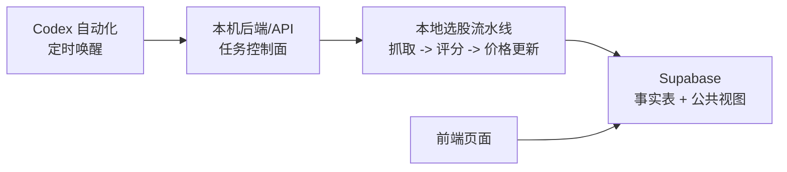

# 牧牛记

牧牛记是一个规则型 A 股选股与复盘系统。当前主架构已经收束为：本机负责执行与写入，Supabase 负责生产数据存储，前端只读 Supabase，Codex 自动化只负责交易日定时唤醒和触发任务。

核心选股算法仍保留在 `skills/stock-selection-agent/scripts/`。本次架构边界的重点是把它包装成稳定的本机任务，而不是重写选股逻辑。

## 架构



- 前端：`frontend/`，Vite + React，生产环境只读取 Supabase 公共视图。
- 本机后端：`backend/`，FastAPI + 本机 job wrapper，提供健康检查、手动触发、任务状态、重试和日志查询。
- 定时触发：Codex 自动化负责交易日唤醒并触发本机任务；本机任务会用交易日配置兜底跳过休市日。
- 数据库：Supabase。事实表只允许 `service_role` 写入，浏览器只使用 anon key 读取公共视图。
- 本地辅助：Excel、`outputs/` 和 `data/dashboard/` 保留为开发、验证和回放资产，不再作为生产主数据源。

## 目录

- `backend/api.py`：本机任务控制面 API。
- `backend/jobs/daily_selection.py`：全量选股 job wrapper，调用既有每日选股脚本并写入 Supabase。
- `backend/jobs/price_refresh.py`：价格刷新 job wrapper，更新历史入选股票最新价格和收益表现。
- `backend/supabase_jobs.py`：`stock_selection_job_runs` 状态写入、查询和本地 fallback。
- `config/local_selection_job.json`：本机全量选股生产配置。
- `config/trading_calendar.json`：A 股交易日配置，支持休市日和补充开市日。
- `config/daily_selection.json`：开发完整流水线配置，可生成本地 Excel 和 dashboard JSON。
- `config/render_daily_selection.json`：历史 Render 配置，已降级为 legacy。
- `frontend/`：只读 Supabase 公共视图的看板。
- `supabase/migrations/`：事实表、RLS、公共视图和本机 job 状态表迁移。
- `docs/local_automation_architecture.md`：本机自动化架构说明。
- `docs/cloud_deployment.md`：历史 Netlify + Render + Supabase 部署说明，仅作 legacy 参考。

## 数据链路

1. Codex 自动化在交易日北京时间 08:30 触发 `daily-full-selection`。
2. 本机 job 计算上一完整交易日，抓取 Tencent 行情和前复权 K 线，生成候选池。
3. 评分脚本输出 `selection_scores.csv` 和 Markdown 报告。
4. `sync_supabase.py` 使用本机 `SUPABASE_SERVICE_ROLE_KEY` 将 run、results 写入 Supabase。
5. Codex 自动化在交易日北京时间 16:10 触发 `daily-price-refresh`。
6. 价格刷新 job 固定以上一交易日作为复盘日期，更新历史入选股票的最新价格、T1/T2/T3 等表现，并同步 `prices/performance`。
7. 前端页面使用 anon key 读取 `dashboard_runs_index`、`dashboard_runs` 和 `v_selection_*` 公共视图。

## 交易日配置

`config/trading_calendar.json` 默认按周一到周五作为交易日。遇到官方休市日时，把日期写入 `holidays`；如果有需要强制视为开市的日期，写入 `makeup_trading_days`。定时任务在非交易日被唤醒时会记录 `result_payload.skipped=true` 并退出，不启动选股或复盘流水线。

## 环境变量

本机复制模板：

```powershell
Copy-Item .\config\local.env.example .\config\local.env
notepad .\config\local.env
```

需要填写：

```text
SUPABASE_URL=
SUPABASE_SERVICE_ROLE_KEY=
ADMIN_TRIGGER_TOKEN=
APP_TIMEZONE=Asia/Shanghai
```

`config/local.env` 已被 git 忽略，不能提交。

前端只允许公开读取配置：

```text
VITE_SUPABASE_URL=
VITE_SUPABASE_ANON_KEY=
VITE_DASHBOARD_RUNS_INDEX_VIEW=dashboard_runs_index
VITE_DASHBOARD_RUN_DETAIL_VIEW=dashboard_runs
VITE_ENABLE_LOCAL_FALLBACK=false
```

不要把 `SUPABASE_SERVICE_ROLE_KEY` 放进 Netlify、`frontend/` 或任何浏览器可见文件。

## 本机运行

安装 Python 依赖：

```powershell
python -m pip install -r .\requirements.txt
```

安装前端依赖：

```powershell
npm.cmd --prefix frontend install
```

本机全量选股 dry-run：

```powershell
python -m backend.jobs.daily_selection --dry-run --trigger-source local
```

本机价格刷新 dry-run：

```powershell
python -m backend.jobs.price_refresh --dry-run --trigger-source local
```

启动本机 API：

```powershell
uvicorn backend.api:app --host 127.0.0.1 --port 8000
```

手动触发全量选股：

```powershell
curl -X POST "http://127.0.0.1:8000/jobs/daily-selection" `
  -H "Authorization: Bearer $env:ADMIN_TRIGGER_TOKEN" `
  -H "Content-Type: application/json" `
  -d "{\"dry_run\": true}"
```

手动触发价格刷新：

```powershell
curl -X POST "http://127.0.0.1:8000/jobs/price-refresh" `
  -H "Authorization: Bearer $env:ADMIN_TRIGGER_TOKEN" `
  -H "Content-Type: application/json" `
  -d "{\"dry_run\": true}"
```

## Supabase

核心对象：

- `stock_selection_runs`
- `stock_selection_results`
- `stock_selection_prices`
- `stock_selection_performance`
- `stock_selection_job_runs`
- 公共视图：`dashboard_runs_index`、`dashboard_runs`、`v_selection_*`

访问模型：

- `service_role`：写入事实表、价格、表现和 job 状态。
- `anon` / `authenticated`：只读 dashboard/public views。
- `stock_selection_job_runs`：只允许 `service_role` 访问。

## 测试

完整测试：

```powershell
python -m unittest discover -s tests -v
```

本机重构契约测试：

```powershell
python -m unittest tests.test_cloud_refactor_contract -v
```

前端构建：

```powershell
npm.cmd --prefix frontend run build
```

确认前端构建产物不含服务端密钥标记：

```powershell
rg "SUPABASE_SERVICE_ROLE_KEY|SERVICE_ROLE|service_role" frontend\dist
```

该命令应无匹配结果。

## 风险说明

牧牛记只做规则化筛选、复盘和数据看板，不构成投资建议。真实使用前仍需结合实时行情、公告、流动性、交易规则和个人风险控制。
