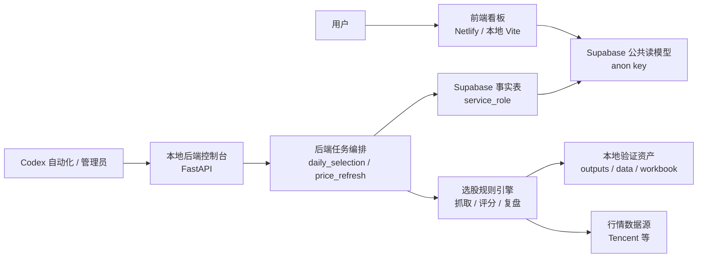

# 牧牛记前后端分离架构重构设计

版本：v1.0  
日期：2026-06-30  
适用范围：牧牛记 A 股规则选股、复盘看板、本地任务控制台、Supabase 数据读写链路  
面向对象：产品、前端、后端、测试、部署维护

## 1. 背景

牧牛记当前已经具备前端目录、后端任务目录、Supabase 迁移和本地自动化脚本，但从产品架构角度仍需要进一步明确前后端边界，避免后续功能扩展时出现以下问题：

- 前端页面同时承担展示、数据清洗、复盘价格补齐和部分业务计算，页面组件会越来越重。
- 后端 API 主要是任务控制台能力，和前端看板的数据读取链路并不是同一个服务边界，需要明确说明。
- 选股算法脚本位于 `skills/stock-selection-agent/scripts/`，它是核心规则引擎，但当前目录名容易让新开发误以为它不属于产品后端。
- Supabase 同时承载生产事实表和浏览器公共读模型，需要明确哪些数据可由前端读取，哪些只能由服务端写入。
- 截图所示的历史复盘表需要稳定支持按日期横向展开价格和收益，例如入选基准价、T1/T2/T3 或具体交易日价格列，不能依赖硬编码列。

本次设计目标不是改写选股逻辑，而是把现有产品拆成清晰的前端产品层、后端任务层、算法引擎层和数据读写层。

## 2. 目标

| 目标 | 说明 |
| --- | --- |
| 前端独立 | `frontend/` 只负责用户界面、筛选交互、数据展示和浏览器安全读取。 |
| 后端独立 | `backend/` 负责任务触发、任务状态、交易日判断、任务日志、服务端凭证和写库编排。 |
| 算法沉淀 | 现有选股评分、行情抓取、复盘分析先作为后端调用的规则引擎保留，后续逐步迁移为后端领域模块。 |
| 数据分层 | Supabase 事实表由后端使用服务端密钥写入，前端只读取公共视图和授权安全列。 |
| 可回放 | `outputs/` 和 `data/dashboard/` 保留为本地验证、调试和回放资产，不作为生产主数据源。 |
| 可验收 | 通过目录结构、接口契约、权限检查、页面效果和自动化任务状态共同验收。 |

## 3. 非目标

| 非目标 | 边界 |
| --- | --- |
| 重写选股策略 | 评分规则、候选池生成和风险阈值不在本次架构设计中改动。 |
| 前端直连本地后端作为生产数据源 | 生产看板仍读取 Supabase 公共读模型，不依赖本地服务在线。 |
| 将服务端密钥放入 Netlify 或浏览器 | `SUPABASE_SERVICE_ROLE_KEY` 只能存在于本地后端或可信服务端环境。 |
| 用 Render 替代本地执行 | 当前主路径仍是本地执行加 Supabase 存储，Render 仅作为历史或未来云端化参考。 |

## 4. 目标架构



架构原则：

- 前端不保存服务端密钥，不触发生产写入，不直接运行选股脚本。
- 后端不渲染页面，不拼接前端 UI 状态，只提供任务控制、任务日志和生产写入能力。
- Supabase 是生产数据中心，事实表面向后端写入，公共视图面向前端读取。
- 选股规则引擎是后端内部能力，短期继续复用现有脚本，长期可迁移到 `backend/domain/`。

## 5. 目录重构设计

### 5.1 目标目录

```text
frontend/
  src/
    app/
      App.jsx
      routes.js
    components/
      MetricCard.jsx
      EmptyState.jsx
      TableShell.jsx
    features/
      dashboard/
        DashboardPage.jsx
        DashboardMetrics.jsx
      runs/
        RunSelector.jsx
        CurrentResultsTable.jsx
      review/
        HistoricalReviewTable.jsx
        PickDetailSidebar.jsx
    services/
      supabaseReadApi.js
      localFallbackApi.js
    utils/
      formatters.js
      stockCode.js
      returns.js
    styles/
      index.css

backend/
  api/
    app.py
    dependencies.py
    job_routes.py
  jobs/
    daily_selection.py
    price_refresh.py
    trading_calendar.py
  services/
    job_service.py
    selection_pipeline_service.py
    price_refresh_service.py
    sync_service.py
  repositories/
    supabase_job_repository.py
    supabase_selection_repository.py
  domain/
    scoring/
    selection/
    review/
  integrations/
    market_data/
    supabase_rest.py
  schemas/
    dashboard_contract.py
    job_contract.py

supabase/
  migrations/

config/
  local_selection_job.json
  daily_selection.json
  trading_calendar.json
  scoring_rules.json

data/
  dashboard/
  snapshots/
  validation/

outputs/
  daily/
```

### 5.2 现有文件映射

| 现有位置 | 目标归属 | 处理方式 |
| --- | --- | --- |
| `frontend/src/App.jsx` | 前端页面层 | 拆成页面、表格、侧栏、筛选、数据服务和格式化工具。 |
| `frontend/src/styles.css` | 前端样式层 | 拆分为全局样式、表格样式、控件样式和响应式样式。 |
| `backend/api.py` | 后端 API 层 | 迁移为 `backend/api/app.py` 和 `backend/api/job_routes.py`。 |
| `backend/jobs/daily_selection.py` | 后端任务层 | 保留任务入口，内部调用 service 层。 |
| `backend/jobs/price_refresh.py` | 后端任务层 | 保留任务入口，内部调用 service 层。 |
| `backend/supabase_jobs.py` | 后端仓储/集成层 | 拆为 job repository 和 Supabase REST client。 |
| `skills/stock-selection-agent/scripts/*.py` | 算法引擎层 | 短期作为后端内部脚本调用，长期迁入 `backend/domain/`。 |
| `supabase/migrations/*.sql` | 数据库层 | 继续保留，新增读模型和权限变更必须通过迁移管理。 |
| `data/dashboard/*.json` | 本地回放层 | 仅用于本地开发 fallback，不作为生产主数据源。 |
| `outputs/daily/*` | 审计和交付物 | 仅在任务成功后发布 `latest`，失败时不覆盖。 |

## 6. 前端产品设计

### 6.1 页面结构

| 页面区域 | 用户目标 | 前端职责 | 数据来源 |
| --- | --- | --- | --- |
| 顶部栏 | 识别产品、切换日期、确认数据来源 | 展示产品名、日期选择器、数据源状态 | `dashboard_runs_index` |
| 指标区 | 快速判断当日选股质量和策略效果 | 展示标的数、最高分、强参与数、T3 胜率、策略结论 | `dashboard_runs` |
| 运行信息条 | 追溯本次结果来源 | 展示 run id、策略版本、市场环境、生成时间 | `dashboard_runs` |
| 筛选区 | 按股票、结论、板块、买点、最低分过滤 | 本地筛选当前已加载明细 | `dashboard_runs.filters` 和 `picks` |
| 当日选股表 | 查看当日入选标的和执行计划 | 展示排名、标的、板块、买点、计划、理由、风险、评分、结论 | `dashboard_runs.picks` |
| 历史复盘表 | 横向比较入选后价格变化 | 动态生成入选基准、后续价格、收益、复盘结果列 | `dashboard_runs.picks` 加 `stock_selection_prices` |
| 详情侧栏 | 查看单只股票完整理由和复盘轨迹 | 展示理由、风险、计划、后续价格列表 | 当前行数据 |
| 空状态/异常态 | 明确数据缺失原因 | 展示读取失败、复盘不足、暂无后续价格 | 前端异常和后端读模型状态 |

### 6.2 截图场景要求

截图展示的是历史复盘表的一行，用户需要横向看到：

- 股票名称和代码，例如股票名加 `300001.SZ`。
- 入选基准价。
- 后续多个交易日价格列，例如 `2026-06-25`、`2026-06-26`、`2026-06-29`。
- 每个价格下方展示相对入选价的涨跌幅。

前端实现要求：

| 要求 | 规则 |
| --- | --- |
| 动态列 | 后续价格列从 `price_points` 或 `stock_selection_prices` 生成，不写死日期。 |
| 基准列 | 入选价格固定作为第一列，文案为 `入选基准`。 |
| 涨跌色彩 | 正收益使用绿色，负收益使用红色，空值保持中性。 |
| 缺失数据 | 某只股票缺少某个后续价格时显示 `-`，不隐藏整行。 |
| 行详情 | 点击历史行后打开详情侧栏，侧栏展示完整价格轨迹。 |
| 移动端 | 表格允许横向滚动，侧栏在窄屏下改为表格下方区域。 |

### 6.3 前端数据访问

前端只允许使用浏览器安全配置：

| 配置 | 用途 |
| --- | --- |
| `VITE_SUPABASE_URL` | Supabase Data API 地址。 |
| `VITE_SUPABASE_ANON_KEY` | 匿名公共读取密钥。 |
| `VITE_DASHBOARD_RUNS_INDEX_VIEW` | 日期索引视图，默认 `dashboard_runs_index`。 |
| `VITE_DASHBOARD_RUN_DETAIL_VIEW` | 运行详情视图，默认 `dashboard_runs`。 |
| `VITE_ENABLE_LOCAL_FALLBACK` | 本地开发时读取 `data/dashboard/`。 |

前端不得出现：

- `SUPABASE_SERVICE_ROLE_KEY`
- 服务端写库 API key
- 本地任务触发 token
- 对 `stock_selection_runs`、`stock_selection_results` 等事实表的写入逻辑

## 7. 后端产品设计

### 7.1 后端职责

| 模块 | 职责 | 用户价值 |
| --- | --- | --- |
| API 控制台 | 提供健康检查、任务触发、任务查询、日志查看、失败重试 | 管理员可以知道任务是否运行、为何失败、能否重试。 |
| 交易日判断 | 根据交易日配置决定是否执行或跳过 | 避免休市日错误抓取和覆盖结果。 |
| 日度选股任务 | 抓取行情、生成候选池、评分、写入 Supabase | 保证每天有完整选股结果。 |
| 价格刷新任务 | 更新历史入选股票的后续价格和收益表现 | 支持复盘和策略有效性判断。 |
| Supabase 写入 | 用服务端凭证写入事实表和任务状态 | 保证生产数据完整且前端不可写。 |
| 日志和 manifest | 保留每次任务命令、返回码、摘要和失败原因 | 支持问题追踪和人工复核。 |

### 7.2 后端 API

所有非健康检查接口必须要求管理员 token。

| 接口 | 用途 | 权限 |
| --- | --- | --- |
| `GET /health` | 本地后端健康检查 | 无需管理员 token |
| `POST /jobs/daily-selection` | 触发日度选股任务 | 管理员 |
| `POST /jobs/price-refresh` | 触发历史价格刷新任务 | 管理员 |
| `GET /jobs` | 查询任务列表 | 管理员 |
| `GET /jobs/{job_id}` | 查询单个任务状态 | 管理员 |
| `GET /jobs/{job_id}/logs` | 查看任务日志摘要 | 管理员 |
| `POST /jobs/{job_id}/retry` | 基于失败任务创建新重试任务 | 管理员 |

任务状态建议统一为：

| 状态 | 含义 |
| --- | --- |
| `queued` | 已接收，等待执行。 |
| `running` | 执行中。 |
| `success` | 执行成功并完成必要写入。 |
| `pending_supabase` | 本地计算完成，但 Supabase 写入未完成或失败，需要补写。 |
| `failed` | 任务失败，结果不得发布为 latest。 |
| `skipped` | 调度触发成功，但因非交易日等规则跳过。 |

### 7.3 后端和算法引擎关系

短期：

- 后端任务继续调用现有脚本，降低重构风险。
- `daily_selection` 负责调用每日选股 runner。
- `price_refresh` 负责调用价格更新、分析、同步脚本。
- `sync_supabase.py` 继续作为写入 Supabase 的主路径。

中期：

- 把行情抓取抽象为 `backend/integrations/market_data/`。
- 把评分规则抽象为 `backend/domain/scoring/`。
- 把复盘收益计算抽象为 `backend/domain/review/`。
- 把 Supabase 写入抽象为 repository，统一处理 payload 规范化、批量 upsert 和错误诊断。

长期：

- 后端 service 层直接调用领域模块，不再通过子进程拼命令。
- 选股规则引擎可以被 CLI、API 和测试共同复用。

## 8. 数据设计

### 8.1 写模型

| 数据对象 | 写入方 | 说明 |
| --- | --- | --- |
| `stock_selection_runs` | 后端 | 每次选股运行的元信息。 |
| `stock_selection_results` | 后端 | 每只入选股票的评分、结论、理由和计划。 |
| `stock_selection_prices` | 后端 | 入选后 T1/T2/T3/LATEST 等价格点。 |
| `stock_selection_performance` | 后端 | 每只股票的收益、胜负、止盈止损和复盘结果。 |
| `stock_selection_job_runs` | 后端 | 本地任务状态、日志摘要、请求和结果 payload。 |

### 8.2 读模型

| 读模型 | 读取方 | 用途 |
| --- | --- | --- |
| `dashboard_runs_index` | 前端 | 日期列表、active run、概览指标。 |
| `dashboard_runs` | 前端 | 单日看板详情和 picks。 |
| `v_selection_runs_public` | 前端/验证 | 公开运行元信息。 |
| `v_selection_results_public` | 前端/验证 | 公开选股明细。 |
| `v_selection_performance_public` | 前端/验证 | 公开复盘表现。 |
| `v_selection_strategy_effectiveness_public` | 前端 | 策略有效性汇总。 |
| `stock_selection_prices` 安全列 | 前端 | 为历史复盘表补充价格点。 |

前端允许读取的 `stock_selection_prices` 字段只包含：

- `run_id`
- `stock_code`
- `trading_day_offset`
- `price_date`
- `close`

收益率可以短期由前端按入选价计算；中期建议后端或视图直接提供 `return_pct`，让前端只负责展示。

## 9. 前后端接口契约

### 9.1 看板索引契约

| 字段 | 类型 | 说明 |
| --- | --- | --- |
| `date` | string | 日期 key，例如 `20260630`。 |
| `selection_date` | string | 展示日期，例如 `2026-06-30`。 |
| `run_id` | string | 当前日期下默认展示的运行 ID。 |
| `label` | string | 日期选项展示文案。 |
| `market_env` | string | 市场环境。 |
| `total_selected_count` | number | 入选数量。 |
| `top_score` | number/null | 最高分。 |
| `average_score` | number/null | 平均分。 |
| `score_buckets` | object | 强参与、轻仓试错、观察、回避等分桶。 |
| `has_review` | boolean | 是否有复盘数据。 |
| `review_status` | string | 复盘状态。 |

### 9.2 看板详情契约

| 字段 | 类型 | 说明 |
| --- | --- | --- |
| `run` | object | 本次运行元信息。 |
| `metrics` | object | 指标区数据。 |
| `strategy_effectiveness` | object | 策略有效性汇总。 |
| `filters` | object | 前端筛选项和数量。 |
| `review` | object | 复盘整体状态和空状态。 |
| `picks` | array | 股票明细列表。 |

`picks` 中单只股票至少包含：

| 字段 | 类型 | 说明 |
| --- | --- | --- |
| `rank` | number | 排名。 |
| `stock_code` | string | 带市场后缀的代码。 |
| `name` | string | 股票名称。 |
| `sector` | string | 板块。 |
| `buy_model` | string | 买点模型。 |
| `plan` | string | 计划。 |
| `notes` | string | 入选理由。 |
| `risks` | string | 风险。 |
| `selection_price` | number/null | 入选价格。 |
| `stop_loss_price` | number/null | 止损价。 |
| `take_profit_price` | number/null | 止盈价。 |
| `total_score` | number/null | 总评分。 |
| `decision` | string | 参与结论。 |
| `review.price_points` | array | 后续价格点。 |

## 10. 迁移实施路径

### 阶段 1：前端解耦

交付内容：

- 从 `App.jsx` 拆出 Supabase 读取服务、数据规范化工具、格式化工具。
- 拆出当前选股表、历史复盘表、详情侧栏、指标卡和筛选组件。
- 保持现有页面视觉和功能不变。

验收：

- 页面仍能显示日期列表、指标区、筛选区、选股明细和历史复盘表。
- 历史价格列由数据驱动生成。
- 前端构建产物不包含 `SERVICE_ROLE` 或服务端密钥。

### 阶段 2：后端分层

交付内容：

- 将 `backend/api.py` 拆为 app、依赖、路由。
- 将 Supabase job 读写从 `supabase_jobs.py` 拆到 repository。
- 将任务编排从 jobs 文件中下沉到 service 层。
- 保持 CLI 和 API 调用方式兼容。

验收：

- `/health`、任务触发、任务查询、日志查询、重试接口行为不变。
- 日度选股和价格刷新 dry-run 仍可执行。
- 非交易日调度仍返回跳过结果。

### 阶段 3：数据契约固化

交付内容：

- 为 `dashboard_runs_index`、`dashboard_runs` 和 `stock_selection_prices` 安全列补充契约测试。
- 明确 `price_points` 的排序规则和空值规则。
- 将 `return_pct` 是否由前端计算或后端提供形成固定规则。

验收：

- 前端可用 Supabase anon key 读取所有页面所需数据。
- anon/authenticated 不可写事实表和 job 表。
- service_role 可写入事实表和 job 表。

### 阶段 4：算法引擎内聚

交付内容：

- 把行情抓取、评分、复盘收益计算抽象为可测试模块。
- 保留原 CLI 包装，避免影响自动化任务。
- 新增领域层单元测试。

验收：

- 原有每日选股输出和新模块输出一致。
- 评分规则仍读取 `config/scoring_rules.json`。
- 腾讯行情 fallback 仍可作为可用数据路径。

### 阶段 5：部署和运维收敛

交付内容：

- Netlify 只部署前端。
- 本地后端只在本机或可信内网运行。
- Codex 自动化只负责唤醒和触发任务，不直接改生产数据。
- 文档中保留 Render 作为 legacy，不作为默认路径。

验收：

- 生产页面访问 `https://bullfarm.netlify.app` 时读取 Supabase 公共视图。
- 本地任务成功后 Supabase 状态和页面渲染状态一致。
- 失败任务不会覆盖 `outputs/daily/latest`。

## 11. 验收标准

| 编号 | 验收项 | 标准 |
| --- | --- | --- |
| A1 | 前端构建 | `frontend` 可正常构建，页面无密钥泄露。 |
| A2 | 前端读取 | 配置 Supabase public key 后能读取日期索引和运行详情。 |
| A3 | 历史复盘表 | 能按数据动态展示多个后续价格日期列和收益率。 |
| A4 | 空状态 | 缺少 Supabase 配置、缺少复盘、缺少价格点时有明确提示。 |
| A5 | 后端 API | 健康检查可访问，任务接口需要管理员 token。 |
| A6 | 日度任务 | 交易日可生成结果并写入 Supabase，非交易日按规则跳过。 |
| A7 | 价格刷新 | 可刷新历史入选股票价格和收益表现。 |
| A8 | 发布安全 | Supabase 写入失败时不覆盖 `latest`。 |
| A9 | 权限隔离 | anon/authenticated 只读公共视图和授权安全列。 |
| A10 | 回归测试 | 现有自动化测试通过，新增契约测试覆盖前后端边界。 |

## 12. 风险和处理

| 风险 | 影响 | 处理 |
| --- | --- | --- |
| 前端继续承担过多数据清洗 | 页面难维护，历史复盘逻辑重复 | 将规范化逻辑拆到 service 和 utils，中期将收益计算下沉到读模型。 |
| Supabase 写入偶发失败 | 任务本地成功但生产数据缺失 | 保留 `pending_supabase` 状态和 manifest，禁止失败时发布 latest。 |
| 视图字段变化破坏前端 | 页面读取失败 | 为读模型增加契约测试，视图新增字段时保持兼容。 |
| 算法脚本迁移引入偏差 | 选股结果不一致 | 分阶段迁移，先包装后内聚，以旧输出作为回归基准。 |
| 本地后端凭证泄露 | 生产数据被误写 | 服务端密钥只放 `config/local.env` 或可信服务端环境，不进入前端和文档示例。 |

## 13. 产品说明

牧牛记只提供规则化筛选、复盘和数据看板能力。页面中的入选、评分、收益和策略结论用于复盘和辅助判断，不构成投资建议。真实交易前仍需结合实时行情、公告、流动性、交易规则和个人风险控制。
