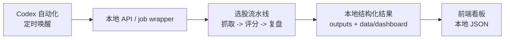

# Local Automation Architecture

## Target State

牧牛记的生产主路径是：



本机负责执行、归档和结构化数据发布。前端只读取 `data/dashboard/`，不依赖远端服务在线。

## Runtime Surfaces

- `backend/api.py` 是本地控制面，负责手动触发、任务查询、日志查询和重试。
- `backend.job_store` 将任务状态持久化到 `outputs/jobs/job_runs.json`。
- `backend.jobs.daily_selection` 包装完整选股流程，并在成功后发布 `latest`。
- `backend.jobs.price_refresh` 更新历史价格、复盘表现，并重建 dashboard JSON。
- `frontend/` 只读取 `/data/dashboard/runs_index.json` 与 `/data/dashboard/runs/*.json`。

## Job Types

### `daily_selection`

默认命令：

```powershell
python -m backend.jobs.daily_selection --trigger-source codex_automation
```

任务内容：

- 判断目标交易日。
- 抓取行情并生成候选池。
- 执行评分。
- 写入 validation workbook。
- 重建 `data/dashboard/`。
- 成功后更新 `outputs/daily/latest` 和 `data/snapshots/latest`。

### `price_refresh`

默认命令：

```powershell
python -m backend.jobs.price_refresh --trigger-source codex_automation
```

任务内容：

- 刷新历史入选股票的后续价格。
- 重算收益、止盈止损和复盘结果。
- 重建 `data/dashboard/`。
- 写入本地 job 状态。

### Trading Calendar

`backend.jobs.trading_calendar` 读取 `config/trading_calendar.json`。自动化触发且未指定日期时，非交易日会记录成功跳过，不启动选股或价格流水线。

## API Endpoints

除健康检查外，接口都需要 `ADMIN_TRIGGER_TOKEN`：

- `GET /health`
- `POST /jobs/daily-selection`
- `POST /jobs/price-refresh`
- `GET /jobs`
- `GET /jobs/{job_id}`
- `GET /jobs/{job_id}/logs`
- `POST /jobs/{job_id}/retry`

## Local Data Contract

- `outputs/jobs/job_runs.json`：任务状态、日志摘要、错误信息和结果 payload。
- `outputs/daily/<YYYYMMDD>/run_manifest.json`：单次选股流水线执行详情。
- `outputs/daily/<YYYYMMDD>/selection_scores.csv`：评分结果。
- `outputs/daily/<YYYYMMDD>/selection_report.md`：Markdown 报告。
- `data/snapshots/<YYYYMMDD>/candidates.csv`：候选池快照。
- `data/dashboard/runs_index.json`：页面日期索引。
- `data/dashboard/runs/<YYYYMMDD>.json`：页面单日详情，包含 picks、metrics、review、price_points。

失败的日度任务只写对应日期 manifest，不覆盖 `latest`。

## Codex Automations

预期有两个本地 cron automation：

- `daily-full-selection`：交易日北京时间 08:30。
- `daily-price-refresh`：交易日北京时间 16:10。

每次自动化应：

1. 确认工作区是 `D:\codex_workspace\B`。
2. 检查 `config/local.env` 是否存在且包含 `ADMIN_TRIGGER_TOKEN`、`APP_TIMEZONE`、`JOB_STORE_PATH`。
3. 优先通过本地 API 触发；本地 API 未运行时，直接运行对应 `python -m backend.jobs.*` 命令。
4. 查询 `outputs/jobs/job_runs.json` 或命令输出，报告 job_id、target_date、status、run_id、attempt_no。
5. 失败时读取 job 日志摘要或 `outputs/daily/<date>/run_manifest.json`，报告失败阶段和下一步建议。
