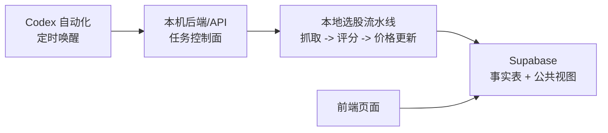

# Local Automation Architecture

## Target State

牧牛记的生产主路径是：



The local machine owns execution and Supabase writes. Supabase owns durable production data. The frontend only reads public Supabase views. Codex automations only wake up and trigger the local jobs.

## Runtime Surfaces

- `backend/api.py` is the local control plane.
- `backend.jobs.daily_selection` wraps the full daily selection flow.
- `backend.jobs.price_refresh` wraps historical latest-price refresh and performance sync.
- `backend.supabase_jobs` writes job state to `stock_selection_job_runs` with a local in-memory fallback for tests and dry local development.
- `frontend/` reads `dashboard_runs_index`, `dashboard_runs`, and `v_selection_*` through the Supabase Data API with anon credentials.
- In local React development, Vite serves `data/dashboard/` as a JSON fallback for offline dashboard debugging.

## Job Types

### `daily_selection`

Purpose:

- Fetch the market snapshot.
- Build the candidate pool.
- Score candidates.
- Sync the daily run and results into Supabase.

Default command:

```powershell
python -m backend.jobs.daily_selection --trigger-source codex_automation
```

The wrapper defaults to `config/local_selection_job.json`, which disables local dashboard generation and historical price update. Those belong to the separate price-refresh job.

When triggered by Codex automation or cron without an explicit date, the wrapper only runs on trading days. Non-trading-day wakeups are recorded as successful skipped jobs with `result_payload.skipped=true`.

### `price_refresh`

Purpose:

- Refresh latest forward prices for historical selections.
- Recompute performance sheets.
- Sync price and performance tables into Supabase.

Default command:

```powershell
python -m backend.jobs.price_refresh --trigger-source codex_automation
```

By default it targets the previous trading day as the review date. When triggered by Codex automation or cron without an explicit date, non-trading-day wakeups are recorded as successful skipped jobs and no price pipeline is started.

### Trading Calendar

`backend.jobs.trading_calendar` reads `config/trading_calendar.json`. The fallback rule treats weekdays as trading days and weekends as closed. Add official exchange holidays to `holidays`; add exceptional open dates to `makeup_trading_days`; use `trading_days` only when a fully explicit allow-list is needed.

## API Endpoints

All non-health endpoints require `ADMIN_TRIGGER_TOKEN` through `Authorization: Bearer ...` or `X-Admin-Token`.

- `GET /health`
- `POST /jobs/daily-selection`
- `POST /jobs/price-refresh`
- `GET /jobs`
- `GET /jobs/{job_id}`
- `GET /jobs/{job_id}/logs`
- `POST /jobs/{job_id}/retry`

The retry endpoint creates a new job record and increments `attempt_no`; it does not mutate the failed job.

## Supabase Contract

Facts and private state:

- `stock_selection_runs`
- `stock_selection_results`
- `stock_selection_prices`
- `stock_selection_performance`
- `stock_selection_job_runs`

Public browser reads:

- `dashboard_runs_index`
- `dashboard_runs`
- `v_selection_runs_public`
- `v_selection_results_public`
- `v_selection_performance_public`
- `v_selection_summary_by_run_public`
- `v_selection_strategy_effectiveness_public`

Security rules:

- `service_role` can write fact tables and job state.
- `anon` and `authenticated` can only read public dashboard views and approved safe columns.
- `stock_selection_job_runs` is private to `service_role`.
- Views use `security_invoker = true`.
- Data API grants and RLS policies are treated as separate layers.

## Publication Safety Gate

The daily selection script publishes `outputs/daily/latest` only after the Supabase stage succeeds. If the Supabase write fails, the run stays failed or pending and `latest` is not replaced.

The price refresh job does not publish `latest`; it only updates historical price/performance records and the job status.

## Codex Automations

Two trading-day cron automations are expected:

- `daily-full-selection`: trading days, Beijing time 08:30.
- `daily-price-refresh`: trading days, Beijing time 16:10.

Each automation should:

1. Check that the workspace is `D:\codex_workspace\B`.
2. Check that `config/local.env` contains Supabase server-side credentials.
3. Trigger the local job through the API if the local server is running; otherwise run the module command directly.
4. Verify the resulting `stock_selection_job_runs` record. If the job was skipped because the local date is not a trading day, report the skip reason instead of treating it as a failure.
5. Report the job id, target date, status, and any failure log excerpt.

Do not put `SUPABASE_SERVICE_ROLE_KEY` in frontend files, Netlify variables, or documentation examples.
